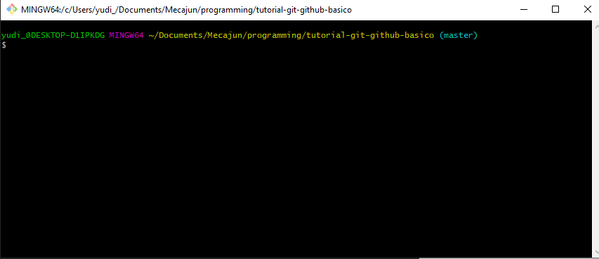
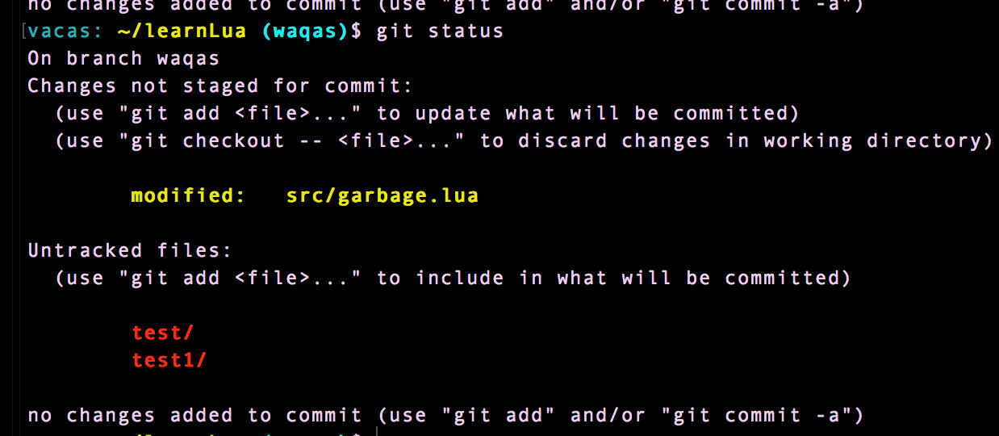
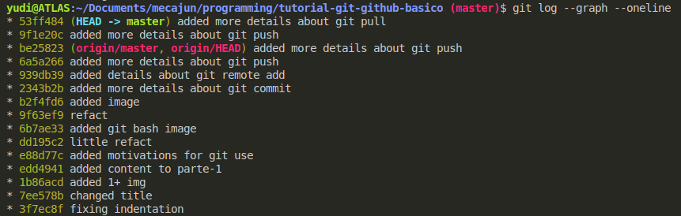
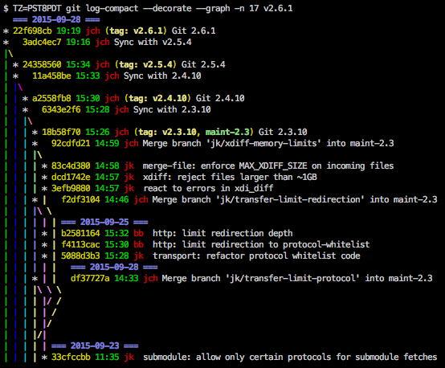

[Parte anterior](/conteudo/parte-1.md) | [Próxima parte](/conteudo/parte-3.md)

---

# Comandos Git
Para começar a explorar os comandos básicos do Git, crie um diretório no seu computador `tutorial-git-github`. Vamos abrir essa pasta no terminal. Certifique-se 
de ter o Git instalado no seu computador.

**Windows:** abra a pasta no Explorador de Arquivos, e clique com o botão direito 
em uma parte vazia da pasta. Dentre as opções, clique em "Abrir Git Bash aqui". Você deve ver uma janela de terminal se abrir no diretório `tutorial-git-github`. Algo assim:




## `git init`
Inicia um **repositório** Git e cria um diretório `.git` onde serão armazenadas as alteraçãoes que ocorrerem no arquivos que forem rastreados.

```sh
.../tutorial-git-github$  ls -a # mostre o que há nesse diretório, incluindo arquivos e pastas escondidas (-a)
.     # diretório atual
..    # diretório pai/diretório anterior
.git
```

Onde fica `.git` é conhecido como diretório raíz do repositório. É geralmente daqui que serão executados todos os comandos, a não ser que o contrário seja especificado.

## `git status`
Mostra quais arquivos estão no **stage**, 
quais estão **unstaged** (não estão no stage),
e quais estão **untracked** (não estão sendo rastreados).
_Stage_ ("palco") é uma área em que alterações nos arquivos estão prontas para serem "commitadas", ou entrarem para a história do repositório.



Se um arquivo não está sendo rastreado, as alterações que ele sofre _não_ entram para a história do repositório e para ele não há controle de versão. Regra geral: um arquivo será rastreado se ele passar pelo `git add` individualmente ou em grupo.


## `git add`
Adiciona arquivos e pastas no rastreio do Git. Os arquivos que passam por esse comando têm suas alterações "escutadas" pelo Git.

`git add <nome-do-arquivo>` para adicionar as alterações no **staging area**.

```sh
# exemplo:
git add programa1.c             
git add index.html programa2.c  # pode ser executado em vários comandos
```

Se você deseja adicionar todas as alterações no próximo commit:
`git add -A`.

Note que o que está sendo adicionado não é apenas o arquivo, mas as alterações feitas nele. Assim, o comando `git add` pode ser executado sobre o mesmo arquivo várias vezes porque o arquivo pode sofrer várias alterações ao longo do tempo.

Se você deseja **unstage** (tirar do stage) um arquivo basta executar:

```sh
git reset HEAD <nome-do-arquivo>
```


## `git commit -m`
Cria um novo ponto na história do repositório com as alterações que estavam no **staging area**. Os arquivos que estavam no **staging area** estão agora **unmodified** (não modificados).

Cada commit deve conter uma breve explicação das alterações que foram feitas. Essa explicação é chamada de **commit message**. No comando, é o `-m` que indica que o próximo argumento é mensagem (deve estar entre aspas: `"mensagem"`).
```sh
# exemplo:
# git add lista_lincada.c             
git commit -m "adicionado função de ordenação para listas lincadas"
```

Se for executado apenas `git commit`, será aberto um editor de texto (Vim, Nano ou algum outro) no qual deve ser escrito a **commit message**.


## Ciclo de vida


## `git remote`
Comandos relacionados ao repositório remoto (pode ser no Github, Gitlab, Bitbucket etc)

### `git remote -v`
Mostra uma lista de repositórios remotos e seus _aliases_ (apelidos). Você pode pensar em um _alias_ como uma variável que armazena uma string, que pode ser o endereço de um repositório remoto.

### `git remote add`
Adiciona o endereço de um repositório remoto que não foi adicionado. Quando estamos falando do repositório remoto hospedado por algum serviço como o próprio Github, é comum chamarmos esse endereço de `origin`.

```sh
# origin é o alias/apelido
# o que vem depois é a URL/endereço do repositório remoto
git remote add origin https://github.com/yudi-azvd/tutorial-git-github-basico.git
```

Geralmente esse comando é utilizado quando o repositório local está sendo criado do zero, ou seja, não foi realizado o comando `git clone <url>`, que clona o repositório remoto do endereço `<url>` na máquina local. Nesse repositório clonado, o endereço do repositório remoto já está definido.


### `git remote set-url`
Define um repositório remoto que _já foi adicionado_. Por exemplo, se o endereço `origin` já está definido no repositório local,é possível alterar seu valor com

```sh
git remote set-url origin uma-string-qualquer # deve ser um endereço válido!
```


## `git push`
Comando que _empurra_ os commits feitos no repositório local para o repositório remoto (para ver o endereço do repositório remoto: `git remote -v`). **Atenção**: no começo é fácil pensar que **push** significa puxar, mas isso está errado. Puxar é outro comando.

**Atenção:** o repositório remoto (no Github, Bitbucket ou Gitlab) já deve existir para o comando funcionar. O comando não cria o repositório automaticamente.

Nesse momento, pode ser pedido a você para usar o seu username e senha do Github. Preencha os dois.

A anatomia do comando é `git push <alias> <branch>`, em que `<alias>` é o endereço do repositório remoto e `<branch>` é **branch** (ramificação) para qual as alterações serão empurradas. Para iniciantes no mundo do Git, essa branch geralmente é a **master**, ou a ramificação principal.

```sh
git push origin master
```

Esse comando pode ser utilizado muitas vezes durante o desenvolvimento. Digitar essas quatro palavras pode ser ligeiramente cansativo. Para evitar isso, basta executar uma vez:

```sh
git push -u origin master
```

E, de agora em diante, é possível executar apenas:

```sh
git push
```

**Atenção:** pode ser que o repositório remoto tenha alterações que não estejam presentes no repositório local. Nesse caso `git push origin master` ou `git push` vai resultar em erro pelo mesmo motivo. Então deve ser feito `git pull origin master` para que o repositório local seja atualizado (sincronizado com o remoto).


## `git pull`
Puxa as alterações do repositório remoto para o repositório local.

```sh
git pull origin master
```

Para que o comando seja executado com sucesso é necessário que a branch atual esteja "limpa", com nada a "commitar". É possível checar se o repositório está nesse estado com `git status`.


## `git log`
Mostra uma lista dos últimos commits com data, messagem do commit, autor e hash do commit. Essa hash é identificador do commit. 

```sh
git log
```



Se houver muitos commits, o Git vai listar apenas os últimos de modo interativo. Você pode apertar <kbd>Enter</kbd> quantas vezes for necessário para ver mais commits ou apertar a tecla <kbd>Q</kbd> para voltar ao modo normal da linha de comando.


É possível ver o histórico de commits de um jeito mais bonitinho. É mais interessante ainda quando se está trabalhando com várias branches.

```sh
git log --graph --online
```




## `git branch`
Lista as **branches** (ramificações) no repositório local indicando a **working branch** (ramificação "atual de trabalho"). Para criar uma branch basta executar:

```sh
git branch <nome-da-sua-branch>
```

A princípio, não existe regra para nomes de branches, mas é _muito recomendado_ pesquisar na internet por alguma convenção ainda mais quando se está trabalhando em um time.

É comum também (mas não obrigatório) exlcuir uma branch depois de terminado o desenvolvimento nela. Para isso, use a flag `-d`:

```sh
git branch -d <nome-da-sua-branch>
```

## `git checkout`
Esse comando serve para mudar a working branch, ou seja, ir para outra branch que já foi criada.

```sh
git checkout <nome-da-sua-branch>
```

Você pode também criar e mudar de branch no mesmo comando com a flag `-b`

```sh
git checkout -b <nome-da-sua-branch>
```

Lembre que você pode checar em qual branch o respositório está com o comando `git branch`. A working branch vai estar marcada com `*` e, possivelmente, com uma cor diferente.

Com esse comando também é possível "voltar no tempo" na história do repositório, ou seja, voltar para qualquer commit. Basta saber a hash do commit. Lembre que você pode obter essa informação com `git log --oneline`.

```sh
git checkout <hash-do-commit>
```


---
[Parte anterior](/conteudo/parte-1.md) | [Referências](/conteudo/referencias.md)
<!-- | [Próxima parte](/conteudo/parte-3.md) -->